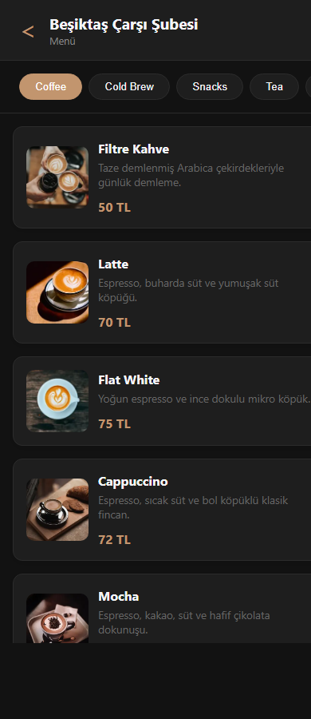
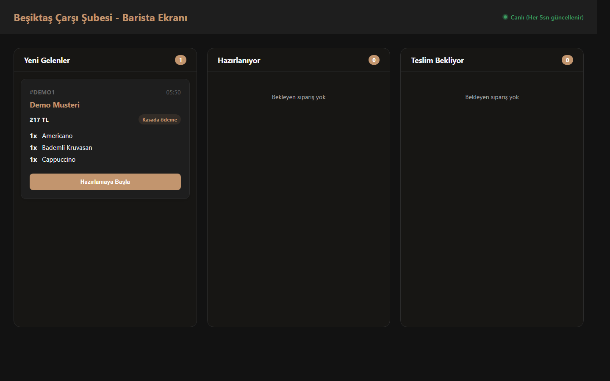
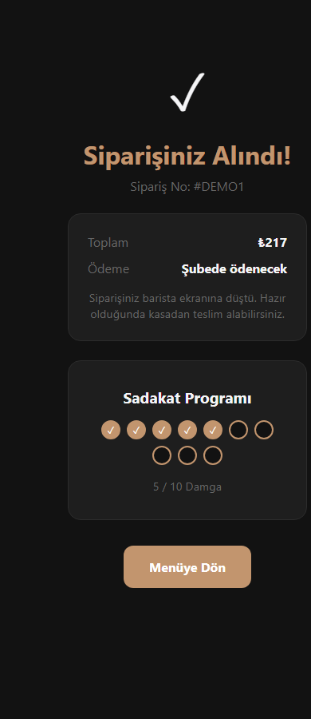

# QR Coffee Sipariş Uygulaması

QR menü üzerinden şube seçimi, ürün görüntüleme, sepet oluşturma, kasada ödeme ve barista sipariş takibi için geliştirilmiş modern bir Next.js uygulaması.

## Ekran Görüntüleri

### Mobil Menü



### Barista Paneli



### Sipariş Onayı



## Özellikler

- Şube bazlı QR menü akışı
- Fotoğraflı ürün kartları ve kategori filtreleri
- Sepet yönetimi ve toplam tutar hesaplama
- Güvenli checkout akışı: tutar ve ürünler sunucu tarafında doğrulanır
- Telefon numarası normalizasyonu
- Kasada ödeme modeli: `IN_STORE` / `PAY_AT_COUNTER`
- Günlük şube sipariş numarası üretimi
- Sadakat damgası sistemi
- Canlı barista ekranı ve sipariş durum güncelleme
- Sipariş teslim edilince ödeme durumunu otomatik `PAID` yapma
- Prisma + SQLite ile hafif yerel veritabanı

## Teknolojiler

- Next.js 16
- React 19
- TypeScript
- Prisma ORM
- SQLite
- CSS Modules
- ESLint

## Kurulum

Projeyi klonladıktan sonra bağımlılıkları yükleyin:

```bash
npm install
```

Veritabanını hazırlayın:

```bash
npx prisma migrate deploy
npx prisma db seed
```

Geliştirme sunucusunu başlatın:

```bash
npm run dev
```

Uygulama varsayılan olarak şu adreste çalışır:

```text
http://localhost:3000
```

## Kullanım

Ana sayfadan bir şube seçilir. Müşteri menüden ürünleri sepete ekler, checkout ekranında ad soyad ve telefon bilgisi girer. Sipariş oluşturulduktan sonra ödeme şubede alınır ve sipariş barista ekranına düşer.

Barista ekranında siparişler şu akışla ilerler:

```text
Yeni Gelenler -> Hazırlanıyor -> Teslim Bekliyor -> Teslim Edildi
```

Sipariş `Teslim Edildi` durumuna alınca ödeme durumu otomatik olarak `Ödendi` olur.

## Komutlar

```bash
npm run dev
npm run build
npm run start
npm run lint
npx prisma db seed
```

## Notlar

Online ödeme entegrasyonu kaldırıldı. Uygulama artık kasada ödeme akışına göre çalışır. Ürün görselleri Unsplash üzerinden yüklenir ve Next Image optimizasyonu için `images.unsplash.com` alan adına izin verilmiştir.
